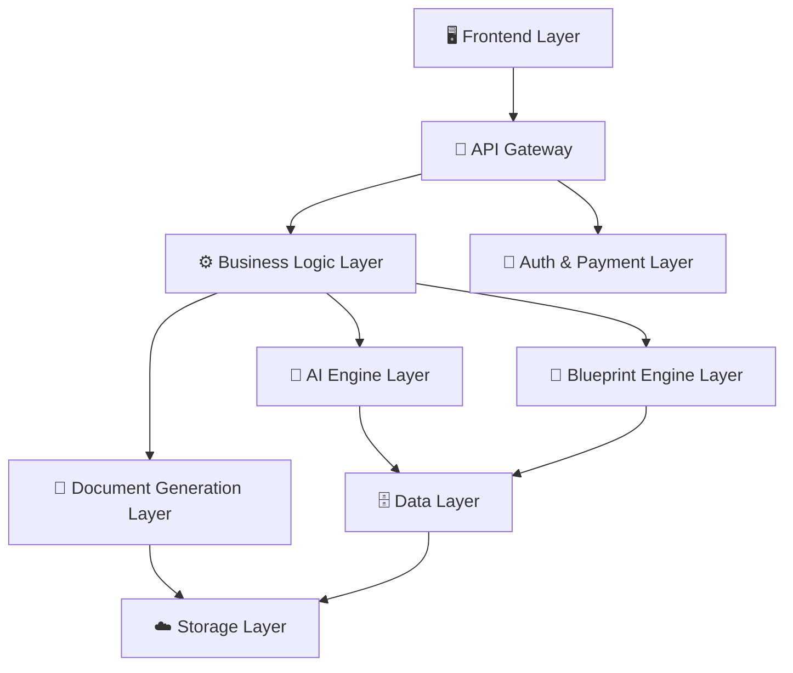
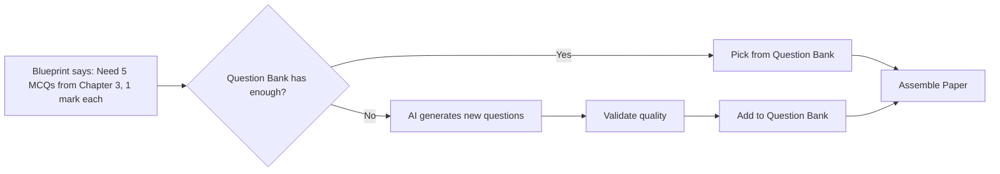
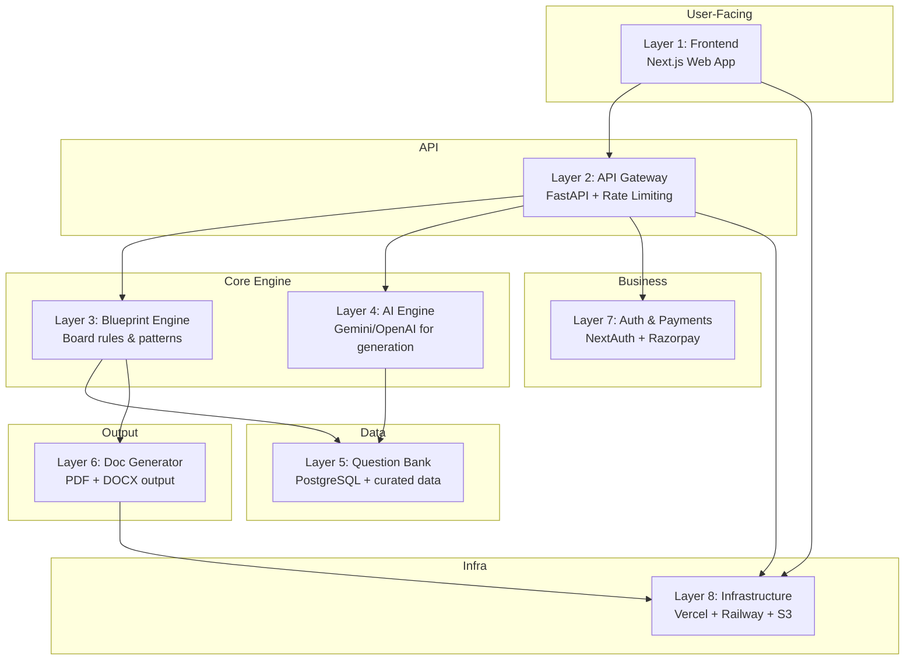

# Technical Layers — AI Teacher Tool

A complete breakdown of every technical layer needed to build your AI-powered question paper & teaching resource generator.

---

## Architecture Overview



---

## Layer 1: Frontend (User Interface)

**Purpose:** No-prompt UI where teachers select options and get results.

### Components

| Component | What It Does | Suggested Tech |
|-----------|-------------|----------------|
| Web App | Dropdowns, preview, download buttons | **Next.js (React)** |
| Auth Pages | Login, signup, forgot password | **NextAuth.js** or **Firebase Auth** |
| Dashboard | View history, saved papers, usage stats | Part of Next.js app |
| Paper Preview | Show generated paper before download | PDF viewer component |
| Admin Panel | Manage question bank, templates, users | **React Admin** or custom |

### Key UI Flow
```
Select Board (CBSE / ICSE / State)
  → Select Class (9 / 10 / 11 / 12)
    → Select Subject (Math / Science / English)
      → Select Paper Type (Annual / Mid-term / Unit Test)
        → Select Total Marks (80 / 70 / 40)
          → [Optional] Select Chapters / Topics
            → Hit "Generate" Button
              → Preview → Download PDF / DOCX
```

---

## Layer 2: API Gateway

**Purpose:** Single entry point for all frontend requests. Handles routing, rate limiting, and authentication.

| Component | What It Does | Suggested Tech |
|-----------|-------------|----------------|
| REST API | Handle all frontend-backend communication | **FastAPI (Python)** |
| Rate Limiter | Prevent abuse, enforce free tier limits | **SlowAPI** or **Redis-based** |
| Request Validator | Validate inputs before processing | **Pydantic models** |
| API Versioning | Support multiple API versions | URL prefix (`/api/v1/`) |

### Key API Endpoints
```
POST /api/v1/generate/question-paper
POST /api/v1/generate/worksheet
POST /api/v1/generate/lesson-plan
GET  /api/v1/boards
GET  /api/v1/subjects?board=cbse&class=10
GET  /api/v1/chapters?board=cbse&class=10&subject=math
GET  /api/v1/history
GET  /api/v1/download/{document_id}
```

---

## Layer 3: Blueprint Engine (The Secret Sauce 🔑)

**Purpose:** Encodes the official board rules — mark distribution, question types, section weightage, and chapter-wise marks. This is what makes your tool **accurate and trustworthy**.

### What It Stores

```
Blueprint = {
  board: "CBSE",
  class: 12,
  subject: "Mathematics",
  total_marks: 80,
  duration: "3 hours",
  sections: [
    {
      name: "Section A",
      question_type: "MCQ",
      marks_per_question: 1,
      num_questions: 20,
      total_marks: 20
    },
    {
      name: "Section B",
      question_type: "Short Answer (SA-I)",
      marks_per_question: 2,
      num_questions: 5,
      total_marks: 10
    },
    {
      name: "Section C",
      question_type: "Short Answer (SA-II)",
      marks_per_question: 3,
      num_questions: 6,
      total_marks: 18
    },
    {
      name: "Section D",
      question_type: "Long Answer",
      marks_per_question: 5,
      num_questions: 4,
      total_marks: 20
    },
    {
      name: "Section E",
      question_type: "Case-Based",
      marks_per_question: 4,
      num_questions: 3,
      total_marks: 12
    }
  ],
  chapter_weightage: {
    "Relations and Functions": 8,
    "Algebra": 10,
    "Calculus": 35,
    "Vectors and 3D": 14,
    "Linear Programming": 5,
    "Probability": 8
  }
}
```

### How to Build It
1. **Collect official blueprints** from board websites (CBSE publishes these)
2. **Encode them as JSON/DB records** — one per board × class × subject
3. **Build a rule engine** that selects questions matching the blueprint
4. **Validate output** — total marks, question count, chapter coverage must match

> [!IMPORTANT]
> This layer is your competitive moat. If your blueprints are accurate, teachers will trust you. Get this wrong and the tool is useless.

---

## Layer 4: AI Engine

**Purpose:** Generate new questions, rephrase existing ones, create lesson plans, and produce other teaching resources.

| Component | What It Does | Suggested Tech |
|-----------|-------------|----------------|
| Question Generator | Generate new questions for a topic + difficulty | **Gemini API** or **OpenAI API** |
| Question Rephraser | Create variations of existing questions | LLM with few-shot prompts |
| Lesson Plan Generator | Create structured lesson plans | LLM + templates |
| Content Validator | Check AI output for accuracy and relevance | Rule-based + LLM review |
| Prompt Templates | Pre-built prompts per subject/board/type | Stored in DB |

### How AI Fits In (Important!)



> [!TIP]
> Don't rely 100% on AI generation. Use a **hybrid approach**: curated question bank first, AI to fill gaps and create variations. This ensures quality.

---

## Layer 5: Question Bank (Data Layer)

**Purpose:** Store curated, validated questions organized by board, class, subject, chapter, difficulty, and marks.

### Database Schema (Core Tables)

```
boards
├── id, name, country, state

classes
├── id, board_id, class_number

subjects
├── id, board_id, class_id, name

chapters
├── id, subject_id, chapter_number, name, weightage_marks

questions
├── id
├── chapter_id
├── question_text
├── question_type (MCQ / SA / LA / Case-Based)
├── marks
├── difficulty (Easy / Medium / Hard)
├── answer (optional)
├── source (Past Paper Year / AI Generated / Manual)
├── is_verified (boolean)
├── options[] (for MCQs)
├── image_url (for diagram-based questions)

blueprints
├── id
├── board_id, class_id, subject_id
├── exam_type (Annual / Mid-term / Unit Test)
├── total_marks
├── sections[] (JSON — type, marks, count)
├── chapter_weightage (JSON)

generated_papers
├── id, user_id, blueprint_id
├── created_at
├── pdf_url, docx_url
├── questions_used[] (foreign keys)
```

### Suggested Tech
- **PostgreSQL** — primary database
- **Redis** — caching frequently used queries
- **Supabase** or **Neon** — managed Postgres (easy to start)

---

## Layer 6: Document Generation

**Purpose:** Convert the assembled question paper into beautifully formatted PDF and DOCX files.

| Component | What It Does | Suggested Tech |
|-----------|-------------|----------------|
| PDF Generator | Create print-ready PDFs | **WeasyPrint** or **ReportLab** (Python) |
| DOCX Generator | Create editable Word documents | **python-docx** |
| Template Engine | HTML/CSS templates for paper layout | **Jinja2** templates |
| Image Handler | Embed diagrams, graphs, math equations | **MathJax** or **KaTeX** for math rendering |

### Paper Layout Template Includes
- School name / exam title header
- Board logo placeholder
- Instructions section
- Section-wise question layout
- Marks printed on the right margin
- Page numbers, watermark (for free tier)
- Answer key (optional, separate page)

> [!TIP]
> Use **HTML → PDF** approach (Jinja2 + WeasyPrint). It gives you full control over styling with CSS and is much easier than building PDFs programmatically.

---

## Layer 7: Auth, Payments & User Management

**Purpose:** Handle user accounts, subscriptions, and access control.

| Component | What It Does | Suggested Tech |
|-----------|-------------|----------------|
| Authentication | Sign up, login, social login | **NextAuth.js** + **JWT** |
| User Roles | Teacher, School Admin, Super Admin | Role-based access control |
| Subscription Management | Free / Premium / School plans | **Razorpay** (India) or **Stripe** |
| Usage Tracking | Count papers generated per user | Redis counters + DB |
| Billing Dashboard | Invoices, plan management | Razorpay dashboard integration |

### Pricing Tiers Example
| Tier | Price | Limits |
|------|-------|--------|
| Free | ₹0 | 3 papers/month, watermarked |
| Pro | ₹299/month | Unlimited papers, no watermark, DOCX |
| School | ₹4999/year | 10 teacher accounts, admin panel |

---

## Layer 8: Infrastructure & DevOps

**Purpose:** Host, deploy, monitor, and scale everything.

| Component | What It Does | Suggested Tech |
|-----------|-------------|----------------|
| Hosting (Frontend) | Serve the web app | **Vercel** (free tier available) |
| Hosting (Backend) | Run the API server | **Railway** / **Render** / **AWS EC2** |
| Database Hosting | Managed PostgreSQL | **Supabase** / **Neon** / **RDS** |
| File Storage | Store generated PDFs/DOCX | **AWS S3** / **Cloudflare R2** |
| CDN | Fast delivery of static assets | **Cloudflare** |
| CI/CD | Automated deployments | **GitHub Actions** |
| Monitoring | Error tracking, uptime | **Sentry** + **UptimeRobot** |
| Analytics | User behavior tracking | **PostHog** (open source) |

---

## Summary: All 8 Layers at a Glance



---

## 🚀 Recommended Build Order

| Phase | What to Build | Timeline |
|-------|--------------|----------|
| **Phase 1 (MVP)** | Frontend + API + Blueprint Engine + Question Bank + PDF Generator | 4–6 weeks |
| **Phase 2** | AI Engine + DOCX support + Auth + Free tier | 2–3 weeks |
| **Phase 3** | Payments + Subscription + School accounts | 2 weeks |
| **Phase 4** | Worksheets, Lesson Plans, PPTs | 3–4 weeks |
| **Phase 5** | Mobile app + Analytics + Scale | Ongoing |

> [!IMPORTANT]
> Start with **Phase 1** only. Get it in front of 10–20 teachers. Their feedback will shape everything else.
